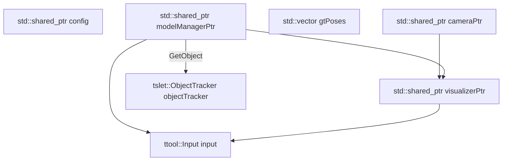
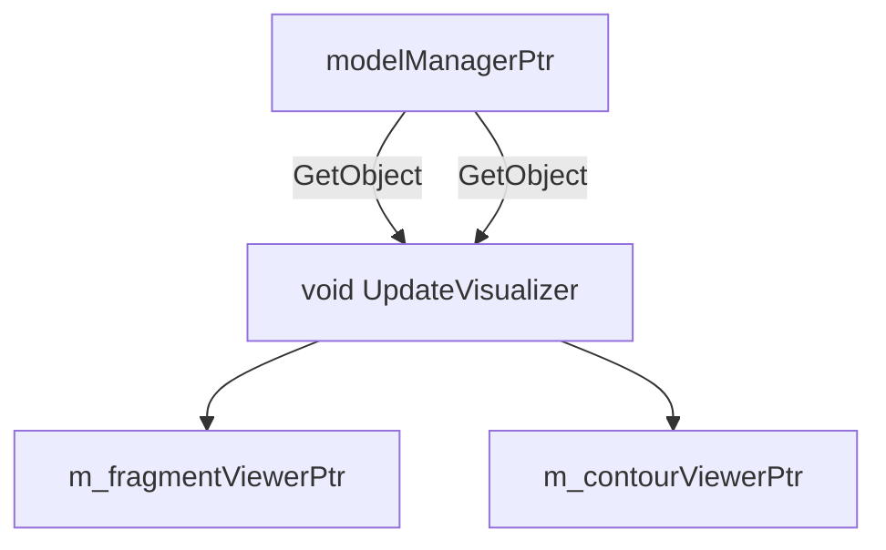
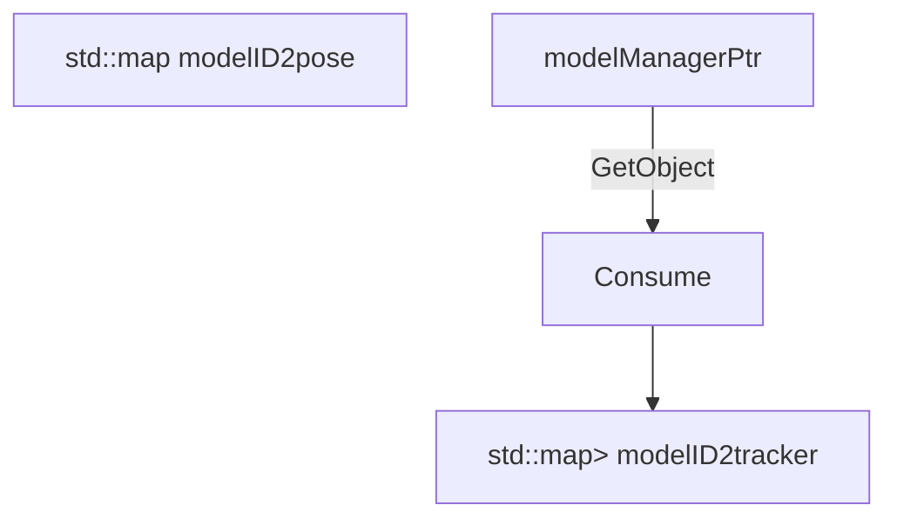

main.cc

```mermaid
graph TD;

config[std::shared_ptr<ttool::Config> config]
cameraPtr[std::shared_ptr<Camera> cameraPtr]
gtPoses[std::vector<cv::Matx44f> gtPoses]
modelManagerPtr[std::shared_ptr<ttool::DModelManager> modelManagerPtr]
visualizerPtr[std::shared_ptr<ttool::Visualizer> visualizerPtr]
input[ttool::Input input]
objectTracker[tslet::ObjectTracker objectTracker]


cameraPtr --> visualizerPtr
modelManagerPtr --> visualizerPtr

modelManagerPtr --> input
visualizerPtr --> input

modelManagerPtr --GetObject--> objectTracker
```

visualizerPtr

```mermaid
graph TD;
m_fragmentViewerPtr[m_fragmentViewerPtr]
m_contourViewerPtr[m_contourViewerPtr]

UpdateVisualizer[void UpdateVisualizer]

modelManagerPtr --GetObject--> UpdateVisualizer --> m_fragmentViewerPtr
modelManagerPtr --GetObject--> UpdateVisualizer --> m_contourViewerPtr
```

objectTracker

```mermaid
graph TD;
modelID2tracker[std::map<int, std::shared_ptr<Tracker>> modelID2tracker]
modelID2pose[std::map<int, cv::Matx44f> modelID2pose]

Consume[Consume]

modelManagerPtr --GetObject--> Consume --> modelID2tracker
```