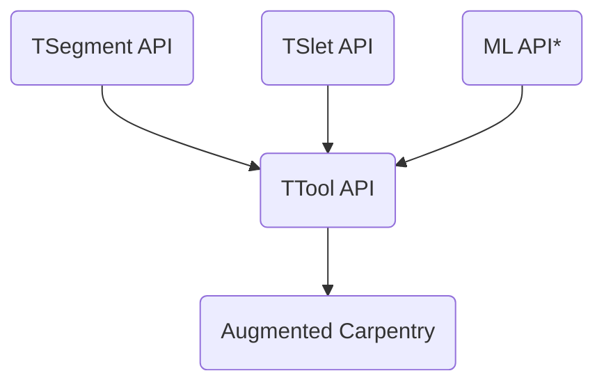

# TTool

This is the repository hosting the API for TTool. It is a program able to detect the 6dof of a fix toolhead from the feed of a fix camera view.

This is the structure of the API. Each sub-API is build first as a `.so` and then link to either the debug executable of ttool or its API (for later integration with AC).

*ML API is the ML based global pose detection and it needs to *