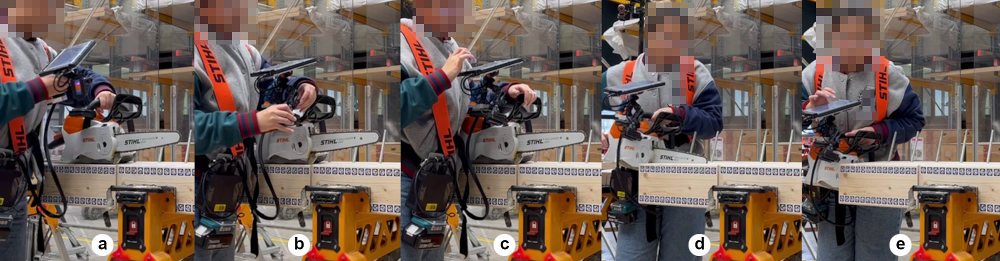
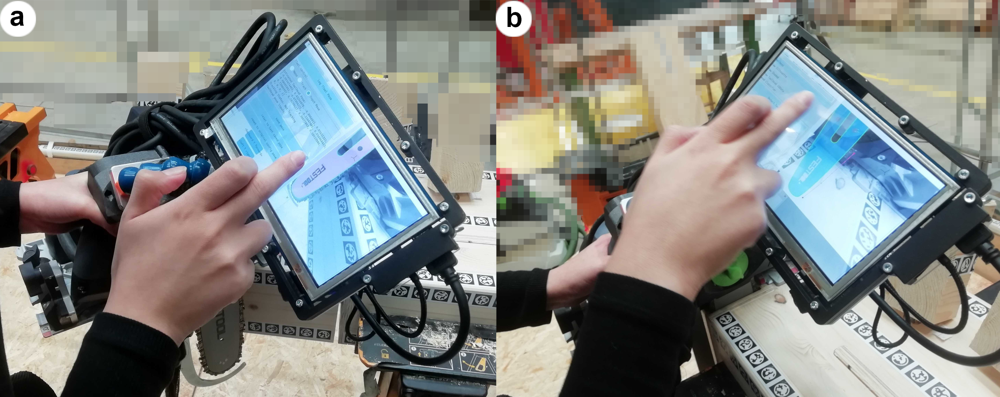

    

    
    
    

    

🌲 `TTool` is developed at the [**Laboratory for Timber Construction**](https://www.epfl.ch/labs/ibois/) (director: Prof.Yves Weinand), at [**EPFL**](https://www.epfl.ch/en/), Lausanne, Switzerland. The project is part of the [**Augmented Carpentry Research**](https://www.epfl.ch/labs/ibois/augmented-carpentry/).

🪚 `TTool` is an open-source **AI-powered and supervised 6DoF detector** for monocular camera. It is developed in C++ and for UNIX systems to allow **accurate end-effectors detection** during **wood-working operations** such as cutting, drilling, sawing and screwing with multiple tools. This is a fundamental component of any subtractive AR fabrication system since you can for instance, calculate and give users feedback on the correct orientation and depth to start and finish a hole or a cut.

🖧 `TTool` is a AI-6DoF pose detector that recognizes automatically tools and allows the user to input an initial pose via an AR manipulator. The pose is then refined by a modified version of [SLET](://github.com/huanghone/SLET) (checkout our [changelog](docs/CHANGELOG.md)) and visualized as a projection onto the camera feed.

↳ `TTool` can be imported as a C++ API in a third project or used as an executable. It is tailored to our specific use case in timber carpentry but see the [Caveats](#caveats) section below to adapt it to your use case.

🚀 For a quick hands-on start or more details, check out our [Wiki](https://github.com/ibois-epfl/TSlam/wiki).

<!--  -->

# How it works

- `a`: the ML classifier detects the tool type from the camera feed and loads the corresponding 3D model.
- `b`: the user inputs an initial pose of the tool via an AR manipulator.
- `c`: the pose is refined with an edge-based algorithm.
- `d`: the pose is projected onto the camera buffer and displayed to the user.
- `e`: the user can now start the operation guided by computed feedback.

On the left, the user can select the tool type and input an initial pose. On the right, the pose is refined and projected onto the camera feed. *The digital twin between the aligned model and the chainsaw plate (or any other tool) is preserved even when occuluded and inside the wood*.

# Caveats
TTool was tailored to our specific use case. If you want to adapt it to your use case, you will need to change the following files:
- `CMakeLists.txt`: comment the line `include(cmake/dataset.cmake)`, it won't use zenodo for the models, but you will have to provide the models yourself, se the wiki on how to do it.
- `assets/config.yaml`: list the models you want to use, and their path by replacing these lines:
  https://github.com/ibois-epfl/TTool/blob/b357383e85708844efd9854291f0f85e521d227b/assets/config.yml#L57-L66
  Be sure to erase these lines specific to our use case:
  https://github.com/ibois-epfl/TTool/blob/b357383e85708844efd9854291f0f85e521d227b/assets/config.yml#L67-L76
- `ML classifier`: to adapt the ML classifier to your use case, you will need to train your own model. We have a template [in this repo](https://github.com/ibois-epfl/TTool-ai).

