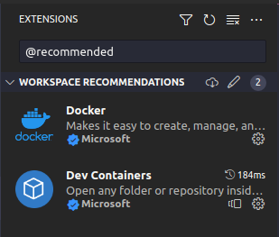
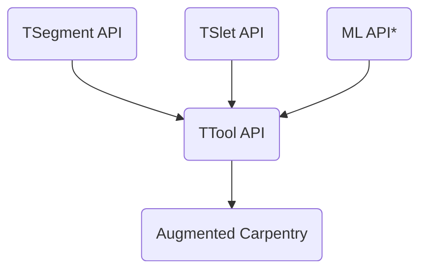

# TTool


## Quick Start
Make sure that [docker-desktop is installed](https://www.docker.com/products/docker-desktop/)
```bash
./build_docker.sh
sudo docker run -it ttool /bin/bash
./build/tool
```

## Development Environment Setup (for VSCode)
0. make sure that [docker-desktop is installed](https://www.docker.com/products/docker-desktop/)
1. clone this repository __with submodules__
```
git clone --recurse-submodules -j8 git@github.com:ibois-epfl/TTool.git
```
2. open the project with VSCode
```
code TTool
```
3. install recommended extensions when prompted



4. 

## CI/CD
If you commit and push some code that does not influence the compilation (e.g. readme, docs, etc), add one of these texts to your commit message, it will stop the run of the github action.
```
[skip ci]
[ci skip]
[no ci]
[skip actions]
[actions skip]
```

This is the repository hosting the API for TTool. It is a program able to detect the 6dof of a fix toolhead from the feed of a fix camera view.

This is the structure of the API. Each sub-API is imported as a git submodule and integrate it from the main `CMakeList.txt` file


*ML API is the ML based global pose detection and it needs to *
