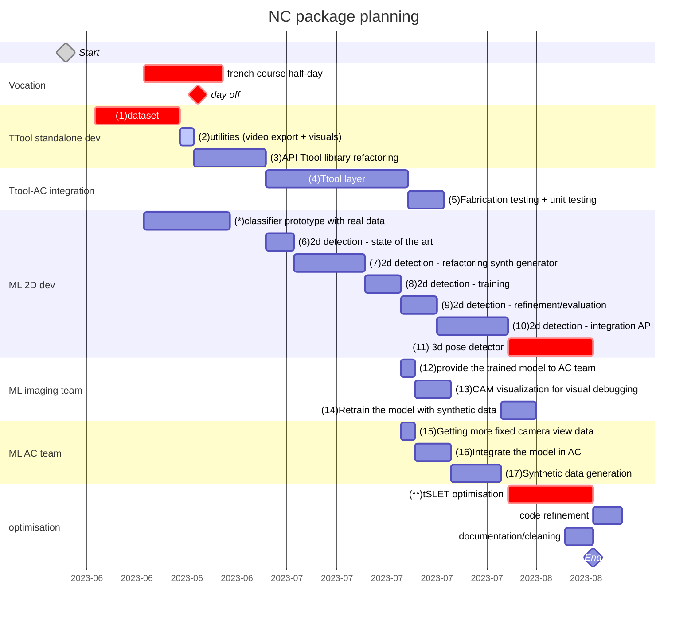

    

    
    
    

# TTool
This is modified from the [SLET](https://github.com/huanghone/SLET) for augmented carpentry reserach. This is the repository hosting the API for TTool. It is a programable to detect the 6dof of a fix toolhead from the feed of a fix camera view. The contributions of this project are
- Making this SLET be more of an API than just a standalone programe.
- Model manager that manages different 3D models for 6DoF tracking. This allows user to change the model to be tracked at ease.
- Input pose to manipulate the 3D models for the initial pose. The initial pose is required by the SLET to begin the tracking. With input pose, the user can give a rough pose of the 3D, and have the SLET refine the pose afterward.
- Config manager to read the config YAML and managing I/O for saving the poses of the models for later.
- GLEW's OpenGL rendering. SLET is using QT5's OpenGL rendering. However, our [augmented carpentry](https://github.com/ibois-epfl/augmented-carpentry) is using GLFW. Hence, we changed the rendering back-end to suit our project.
- RESET, FREEZE, TRACK implementation. We found the correlation between the average score of the search points and the quality of the tracking. We added a thresholding to the SLET to exploit this score. As a consequece, the tracking works better on our setting of a fixed camera mounting on the toolhead.

# Wiki
The wiki of this project is hosted on [github](https://github.com/ibois-epfl/TTool/wiki)

---

## NC description working packages
- [ ] **(1) dataset**: the dataset needs to be finished and uploaded on zenodo. Here's the upcomong tasks:
  - [x] chainsaw blade to scan
  - [ ] long drillb its (x2) to scan
  - [x] refactor and reorder the dataset
  - [x] add to the dataset: circular sawblade, saber sawblade, (optional) drillbit, check if it exists
  - [x] refactor dataset nameing: <englishname>_<widthmm>_<lengthmm> (e.g. spadedrill_25_115)
  - [x] integrate downloading procedures in AC and TTool

- [x] **(2) utilities**: all utilities for the documentation of the developement needs to be implemented:
  - [x] video recorder (with and without gui images)
  - [x] camera pose output
  - [x] log output with fabrication info

- [x] **(3) API Ttool library refactoring**: the TTool needs to be refactored to an API. The executable should only use calls from the API. The API will be integrated to AC in the package later.

- [x] **(4) Ttool layer**: in AC the tool header recognition needs to occupy a layer folling the AC structure and calls from the TTool API take place unikely there. It is possible that some level of multithreading (?) or corutine needs to be implemented to avoid bottlenecks in the main AC rander thread.

- [ ] **(5) Fabrication testing + unit testing**: the ttool layer integration in AC needs to be tested in fabrication scenario and features and modifications will be added following observations and quick user tests.

- [ ] **(6) 2d detection - state of the art**: some days will be reserved to an extensive review of the existing code that can be used in our application. Once the model identified it will be vet and discussed before starting the development.

- [ ] **(7-8-9-10) 2d detection - generator/training/refinement**: classical ML development for the custom training based on pre-existing synthetic data generator. The generator will need to be refacotered to add:
  - [ ] general simplifications
  - [ ] connection to the open-source dataset
  - [ ] procedural background images
  - [ ] procedural lighting
  - [ ] format output based on the chosen training format

- [ ] **(11) (optional) 3d pose detector**: if we are on time, 2 weeks will be reserved to the integration of a initial 6DOF pose detector to avoid the manual placing of the object.

- [ ] **optimisation**:
  - [ ] [Track's RunIteration](./src/tracker_sle.cc#L185) has fixed number of run
  - [ ] Search line depends on the size of the Object3D. This leads to slower [EstimatePose](./src/tracker_sle.cc#L306) on some models

