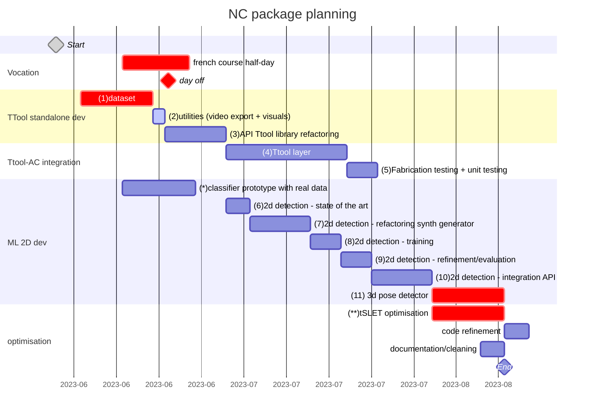

<p align="center">
    
</p>
<p align="center">
    
    
    
</p>



## NC description working packages
- [ ] **(1) dataset**: the dataset needs to be finished and uploaded on zenodo. Here's the upcomong tasks:
  - [x] chainsaw blade to scan
  - [ ] long drillb its (x2) to scan
  - [x] refactor and reorder the dataset
  - [x] add to the dataset: circular sawblade, saber sawblade, (optional) drillbit, check if it exists
  - [x] refactor dataset nameing: <englishname>_<widthmm>_<lengthmm> (e.g. spadedrill_25_115)
  - [x] integrate downloading procedures in AC and TTool

- [x] **(2) utilities**: all utilities for the documentation of the developement needs to be implemented:
  - [x] video recorder (with and without gui images)
  - [x] camera pose output
  - [x] log output with fabrication info

- [x] **(3) API Ttool library refactoring**: the TTool needs to be refactored to an API. The executable should only use calls from the API. The API will be integrated to AC in the package later.

- [x] **(4) Ttool layer**: in AC the tool header recognition needs to occupy a layer folling the AC structure and calls from the TTool API take place unikely there. It is possible that some level of multithreading (?) or corutine needs to be implemented to avoid bottlenecks in the main AC rander thread.

- [ ] **(5) Fabrication testing + unit testing**: the ttool layer integration in AC needs to be tested in fabrication scenario and features and modifications will be added following observations and quick user tests.

- [ ] **(6) 2d detection - state of the art**: some days will be reserved to an extensive review of the existing code that can be used in our application. Once the model identified it will be vet and discussed before starting the development.

- [ ] **(7-8-9-10) 2d detection - generator/training/refinement**: classical ML development for the custom training based on pre-existing synthetic data generator. The generator will need to be refacotered to add:
  - [ ] general simplifications
  - [ ] connection to the open-source dataset
  - [ ] procedural background images
  - [ ] procedural lighting
  - [ ] format output based on the chosen training format

- [ ] **(11) (optional) 3d pose detector**: if we are on time, 2 weeks will be reserved to the integration of a initial 6DOF pose detector to avoid the manual placing of the object.

- [ ] **optimisation**:
  - [ ] [Track's RunIteration](./src/tracker_sle.cc#L185) has fixed number of run
  - [ ] Search line depends on the size of the Object3D. This leads to slower [EstimatePose](./src/tracker_sle.cc#L306) on some models

---

# TTool
This is modified from the [SLET](https://github.com/huanghone/SLET) for augmented carpentry reserach. This is the repository hosting the API for TTool. It is a programable to detect the 6dof of a fix toolhead from the feed of a fix camera view. The contributions of this project are
- Making this SLET be more of an API than just a standalone programe.
- Model manager that manages different 3D models for 6DoF tracking. This allows user to change the model to be tracked at ease.
- Input pose to manipulate the 3D models for the initial pose. The initial pose is required by the SLET to begin the tracking. With input pose, the user can give a rough pose of the 3D, and have the SLET refine the pose afterward.
- Config manager to read the config YAML and managing I/O for saving the poses of the models for later.
- GLEW's OpenGL rendering. SLET is using QT5's OpenGL rendering. However, our [augmented carpentry](https://github.com/ibois-epfl/augmented-carpentry) is using GLFW. Hence, we changed the rendering back-end to suit our project.
- RESET, FREEZE, TRACK implementation. We found the correlation between the average score of the search points and the quality of the tracking. We added a thresholding to the SLET to exploit this score. As a consequece, the tracking works better on our setting of a fixed camera mounting on the toolhead.

## Config & Build
```bash
./config.sh
./build.sh

# or
cmake -S . -B build
cmake --build build
```
# Install/uninstall
Install is needed when used TTool as a library for other projects. This will installation allows CMake's `find_package` to find `TTool`
```bash
sudo cmake --install build
```
```bash
sudo cmake --build build --target uninstall
```
## Run executable
This script builds and then run the standalone TTool program.
```bash
cmake -S . -B build && cmake --build build && ./build/ttoolexec -c 0 -l "./assets/calibration_orange_A_1280_720_r.yml" -t -s
```
where,

- `[-h,--help]`: print this message
- `[-c,--camera]`: camera index
- `[-l,--calib]`: calibration file for the camera
- `[-s,--save]`: record video of session, give custom path for output (default: ./default)
- `[-t,--trackPose]`: it saves all poses and objects in a log file

### Calibration file
A calibration file contains the information of the camera device to be used with the TTool.
This includes the camera image size, camera matrix and distortion coefficients of the camera.
To obtain this file, please refer to this [link](https://docs.opencv.org/4.x/dc/dbb/tutorial_py_calibration.html). 
This is an example of how a [calibration file](./assets/calibration_orange_B_1280_720_r.yml) looks like.
```yml
%YAML:1.0
---
image_width: 1280
image_height: 720
camera_matrix: !!opencv-matrix
   rows: 3
   cols: 3
   dt: d
   data: [ 5.6160752462847097e+02, 0.,
           6.4138172226013501e+02, 0.,
           5.6291538638344332e+02, 3.4156306804983251e+02,
           0., 0., 1. ]
distortion_coefficients: !!opencv-matrix
   rows: 1
   cols: 5
   dt: d
   data: [ -2.5303888172190003e-01, 8.3509753739103201e-02,
            3.7774747611573724e-05, 2.2045706561633034e-04,
            -1.3650724983076233e-02 ]
```

### Configuration File
A configuration file contains the information about the View, SLET, Model and Augmented Carpentry configuration.
The comments indicate where a group of parameters belongs.

```yml
%YAML:1.0
---
# View configuration
zn: 9.9999997473787516e-05
zf: 4000.

# SLET configuration
histOffset: 100
histRad: 40
searchRad: 25

# Model configuration
groundTruthPoses:
   - [ 9.84866619e-01, -4.03894819e-02, 1.68541461e-01, -1.62771076e-01,
       1.18437737e-01, 9.79524612e-01, -5.95245212e-02, -9.92136419e-01,
       1.10068895e-01, 0., 0., 1.39999986e-01 ]
   - [ -5.42542815e-01, 8.39947045e-01, -1.11253709e-02, 5.06054997e-01,
       3.16238910e-01, -8.02426398e-01, -6.70481861e-01, -4.40981954e-01,
       -5.96643448e-01, -1.26680557e-03, 4.37926613e-02, 2.52720535e-01 ]
   - [ 8.19440663e-01, 5.45331001e-01, -1.76395491e-01, 1.42224208e-01,
       -4.91604596e-01, -8.59123707e-01, -5.55223823e-01, 6.78913355e-01,
       -4.80406970e-01, 1.67723373e-02, 2.61279512e-02, 1.92897707e-01 ]
   - [ 9.50834990e-01, 2.37247661e-01, -1.99040413e-01, 2.44926587e-02,
       -6.98316872e-01, -7.15365469e-01, -3.08712870e-01, 6.75321281e-01,
       -6.69801235e-01, -2.26506889e-02, 2.32661795e-02, 1.76990986e-01 ]
   - [ -8.28246951e-01, 2.30366185e-01, 5.10807216e-01, 2.39123389e-01,
       -6.79095149e-01, 6.94000125e-01, 5.06760836e-01, 6.96950197e-01,
       5.07382751e-01, -2.56683957e-02, 2.72371043e-02, 1.72090665e-01 ]
   - [ -8.07440519e-01, 4.48605478e-01, -3.83105516e-01, -5.85106611e-01,
       -6.91857159e-01, 4.23044086e-01, -7.52737448e-02, 5.65754294e-01,
       8.21124077e-01, -5.82594611e-03, 2.99568456e-02, 1.46538332e-01 ]
   - [ -7.73640037e-01, 4.15423065e-01, -4.78431463e-01, -5.23223341e-01,
       -8.44716668e-01, 1.12603128e-01, -3.57363552e-01, 3.37440640e-01,
       8.70876431e-01, 0., 0., 2.20000029e-01 ]
   - [ 1.33818597e-01, 8.97907972e-01, 4.19309229e-01, 9.80942905e-01,
       -5.99305406e-02, -1.84715152e-01, -1.40733391e-01, 4.36035246e-01,
       -8.88844311e-01, 2.64838710e-02, 1.45047512e-02, 1.02048650e-01 ]
   - [ 1.85747266e-01, -4.76315729e-02, -9.81413007e-01, -4.00147825e-01,
       9.08572972e-01, -1.19829834e-01, 8.97417665e-01, 4.14981604e-01,
       1.49699569e-01, 6.66959509e-02, -1.05816480e-02, 7.78000727e-02 ]
   - [ -5.42542815e-01, 8.39947045e-01, -1.11253709e-02, 5.06054997e-01,
       3.16238910e-01, -8.02426398e-01, -6.70481861e-01, -4.40981954e-01,
       -5.96643448e-01, -1.26680557e-03, 4.37926613e-02, 2.52720535e-01 ]
   - [ 9.84866619e-01, -4.03894819e-02, 1.68541461e-01, -1.62771076e-01,
       1.18437737e-01, 9.79524612e-01, -5.95245212e-02, -9.92136419e-01,
       1.10068895e-01, 0., 0., 1.39999986e-01 ]
modelFiles:
   - "/home/tpp/IBOIS/TTool/assets/toolheads/circular_saw_blade_makita_190/model.obj"
   - "/home/tpp/IBOIS/TTool/assets/toolheads/chain_saw_blade_f_250/model.obj"
   - "/home/tpp/IBOIS/TTool/assets/toolheads/auger_drill_bit_20_235/model.obj"
   - "/home/tpp/IBOIS/TTool/assets/toolheads/twist_drill_bit_32_165/model.obj"
   - "/home/tpp/IBOIS/TTool/assets/toolheads/self_feeding_bit_40_90/model.obj"
   - "/home/tpp/IBOIS/TTool/assets/toolheads/self_feeding_bit_50_90/model.obj"
   - "/home/tpp/IBOIS/TTool/assets/toolheads/saber_saw_blade_makita_t/model.obj"
   - "/home/tpp/IBOIS/TTool/assets/toolheads/brad_point_drill_bit_20_150/model.obj"
   - "/home/tpp/IBOIS/TTool/assets/toolheads/spade_drill_bit_25_150/model.obj"

# Augmented Carpentry
acitFiles:
   - "/home/tpp/IBOIS/TTool/assets/toolheads/twist_drill_bit_32_165/metadata.acit"
   - "/home/tpp/IBOIS/TTool/assets/toolheads/brad_point_drill_bit_20_150/metadata.acit"
   - "/home/tpp/IBOIS/TTool/assets/toolheads/self_feeding_bit_40_90/metadata.acit"
   - "/home/tpp/IBOIS/TTool/assets/toolheads/spade_drill_bit_25_150/metadata.acit"
   - "/home/tpp/IBOIS/TTool/assets/toolheads/saber_saw_blade_makita_t/metadata.acit"
   - "/home/tpp/IBOIS/TTool/assets/toolheads/auger_drill_bit_20_235/metadata.acit"
   - "/home/tpp/IBOIS/TTool/assets/toolheads/self_feeding_bit_50_90/metadata.acit"
   - "/home/tpp/IBOIS/TTool/assets/toolheads/chain_saw_blade_f_250/metadata.acit"
   - "/home/tpp/IBOIS/TTool/assets/toolheads/circular_saw_blade_makita_190/metadata.acit"

```

The groundTruthPoses is in the format of 3x3 rotation matrix followed by a vector of a translation matrix.
```
{
  R00, R01, R02,
  R10, R11, R12,
  R20, R21, R22,
  T_x, T_y, T_z,
}
```

## TTool API - where to start using / developing
In order to use this project as an API or start developing from this project, please start from [ttool.h](./include/ttool.hh). This is the header of the class `ttool` from which you can make a call to all the APIs.

In order to see how [ttool.h](./include/ttool.hh) is being used, we created a standalone program for this project. This executable file is [main.cc](./src/main.cc). It is a good demonstration of how `ttool` is being used a called.

Essentially, this is how ttool is used in the main. Other parts of the `main.cc` are just the object for ttool standalone program.
```cpp
#include "ttool.hh"

...

// ttool setup with `std::string` configFilePath and `std::string` calibFilePath
std::shared_ptr<ttool::TTool> ttool = std::make_shared<ttool::TTool>(configFilePath, calibFilePath);

// changing the model to be tracked, adjusting the 6DoF pose of the model via `char` key.
ttool->ManipulateModel(key);

// Estimate the pose from `cv::Mat` image
ttool->RunOnAFrame(image);

// Getting the estimated pose
cv::Matx44f pose = ttool->GetPose();
```

### Standalone notes
Now that the `ttool` runs alone, there might be no GLFW initialization/OpenGL context that the SLET tracking can run. Thus, in the `main.cc`, it calls intailization and termination before and after using `ttool` or using any OpenGL. 

🚧 **THIS APPLIES TO EVERTHING RELATED TO OPENGL, INCLUDING the ttool::standaloneUtils::Visualizer** 🚧

```cpp
#include "util.hh"

...

// Before intializing and using `ttool`
// Intiailizing GLFW
auto GLFWWindow = ttool::standaloneUtils::InitializeStandalone();

... // Using `ttool`, or anything related to OpenGL

// After finished using `ttool`
// Terminate GLFW
ttool::standaloneUtils::TerminateStandalone(GLFWWindow);
```

Consequently, we can see the `main.cc` of the standalone program be the following
```cpp
#include "ttool.hh"
#include "util.hh"

// Before intializing and using `ttool`
// Intiailizing GLFW
auto GLFWWindow = ttool::standaloneUtils::InitializeStandalone();

//======== BEGIN Using `ttool`, or anything related to OpenGL ========//
// ttool setup with `std::string` configFilePath and `std::string` calibFilePath
std::shared_ptr<ttool::TTool> ttool = std::make_shared<ttool::TTool>(configFilePath, calibFilePath);

// changing the model to be tracked, adjusting the 6DoF pose of the model via `char` key.
ttool->ManipulateModel(key);

// Estimate the pose from `cv::Mat` image
ttool->RunOnAFrame(image);

// Getting the estimated pose
cv::Matx44f pose = ttool->GetPose();
//======== END Using `ttool`, or anything related to OpenGL ========//

// After finished using `ttool`
// Terminate GLFW
ttool::standaloneUtils::TerminateStandalone(GLFWWindow);
```

There are other `ttool::standaloneUtils` that might be useful, but not vital for TTool API. This includes `ttool::standaloneUtils::Camera` and `ttool::standaloneUtils::Visualizer`.

`ttool::standaloneUtils::Camera` was modified from SLET for managing the camera and undistort the frame with the calibration file.

`ttool::standaloneUtils::Visualizer` was modified the user interface of the standalone program that shows all the keymap help, useful information and most importantly, visualize the 3D model to see the tracker.

How to initialize and use them can also be seen in the `main.cc`.
## CI/CD
If you commit and push some code that does not influence the compilation (e.g. readme, docs, etc), add one of these texts to your commit message, it will stop the run of the github action.
```
[skip ci]
[ci skip]
[no ci]
[skip actions]
[actions skip]
```
