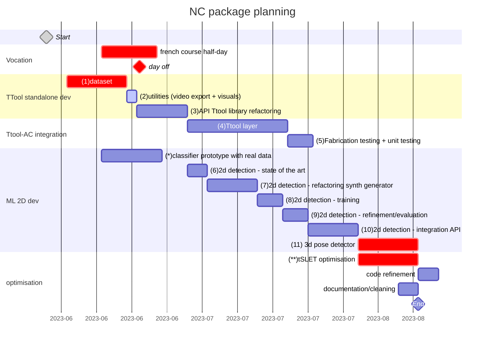

<p align="center">
    
</p>
<p align="center">
    
    
    
</p>



## NC description working packages
- [ ] **(1) dataset**: the dataset needs to be finished and uploaded on zenodo. Here's the upcomong tasks:
  - [ ] chainsaw blade to scan
  - [ ] long drillb its (x2) to scan
  - [ ] refactor and reorder the dataset
  - [ ] add to the dataset: circular sawblade, saber sawblade, (optional) drillbit, check if it exists
  - [ ] refactor dataset nameing: <englishname>_<widthmm>_<lengthmm> (e.g. spadedrill_25_115)
  - [ ] integrate downloading procedures in AC and TTool

- [ ] **(2) utilities**: all utilities for the documentation of the developement needs to be implemented:
  - [x] video recorder (with and without gui images)
  - [ ] camera pose output
  - [ ] log output with fabrication info

- [ ] **(3) API Ttool library refactoring**: the TTool needs to be refactored to an API. The executable should only use calls from the API. The API will be integrated to AC in the package later.

- [ ] **(4) Ttool layer**: in AC the tool header recognition needs to occupy a layer folling the AC structure and calls from the TTool API take place unikely there. It is possible that some level of multithreading (?) or corutine needs to be implemented to avoid bottlenecks in the main AC rander thread.

- [ ] **(5) Fabrication testing + unit testing**: the ttol layer in tegration in AC needs to be tested in fabrication scenario and features and modifications will be added following observations and quick user tests.

- [ ] **(6) 2d detection - state of the art**: some days will be reserved to an extensive review of the existing code that can be used in our application. Once the model identified it will be vet and discussed before starting the development.

- [ ] **(7-8-9-10) 2d detection - generator/training/refinement**: classical ML development for the custom training based on pre-existing synthetic data generator. The generator will need to be refacotered to add:
  - [ ] general simplifications
  - [ ] connection to the open-source dataset
  - [ ] procedural background images
  - [ ] procedural lighting
  - [ ] format output based on the chosen training format

- [ ] **(11) (optional) 3d pose detector**: if we are on time, 2 weeks will be reserved to the integration of a initial 6DOF pose detector to avoid the manual placing of the object.

- [ ] **optimisation**:
  - [ ] [Track's RunIteration](./src/tracker_sle.cc#L185) has fixed number of run
  - [ ] Search line depends on the size of the Object3D. This leads to slower [EstimatePose](./src/tracker_sle.cc#L306) on some models

---

# TTool
This is the repository hosting the API for TTool. It is a program able to detect the 6dof of a fix toolhead from the feed of a fix camera view.

## Config & Build
```bash
cmake -S . -B build
cmake --build build
```
# Install/uninstall
```bash
sudo cmake --install build
```
```bash
sudo cmake --build build --target uninstall
```
## Run executable

```bash
cmake -S . -B build && cmake --build build && ./build/ttool -c 0 -l "./assets/calibration_orange_A_1280_720_r.yml" -t -s
```
where,

- `[-h,--help]`: print this message
- `[-c,--camera]`: camera index
- `[-l,--calib]`: calibration file for the camera
- `[-s,--save]`: record video of session, give custom path for output (default: ./default)
- `[-t,--trackPose]`: it saves all poses and objects in a log file


## CI/CD
If you commit and push some code that does not influence the compilation (e.g. readme, docs, etc), add one of these texts to your commit message, it will stop the run of the github action.
```
[skip ci]
[ci skip]
[no ci]
[skip actions]
[actions skip]
```
