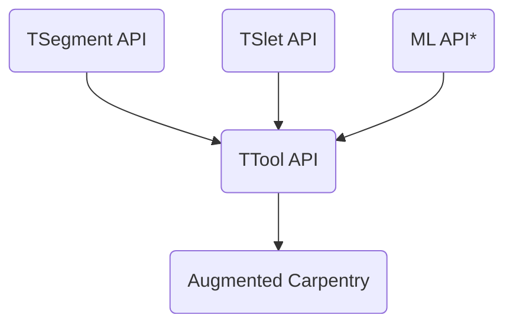

# TTool


# Quick Start
Make sure that docker-desktop is installed
```bash
./build_docker.sh
sudo docker run -it ttool /bin/bash
./build/tool
```

This is the repository hosting the API for TTool. It is a program able to detect the 6dof of a fix toolhead from the feed of a fix camera view.

This is the structure of the API. Each sub-API is imported as a git submodule and integrate it from the main `CMakeList.txt` file


*ML API is the ML based global pose detection and it needs to *
