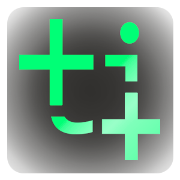

<p align="center">
    
</p>
<p align="center">
    
    
    
</p>

# TTool
This is the repository hosting the API for TTool. It is a program able to detect the 6dof of a fix toolhead from the feed of a fix camera view.


## TTool Dataflow


## CI/CD
If you commit and push some code that does not influence the compilation (e.g. readme, docs, etc), add one of these texts to your commit message, it will stop the run of the github action.
```
[skip ci]
[ci skip]
[no ci]
[skip actions]
[actions skip]
```