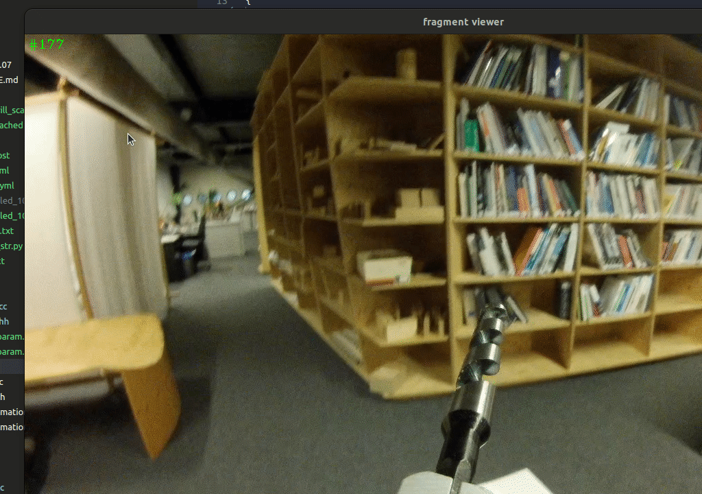
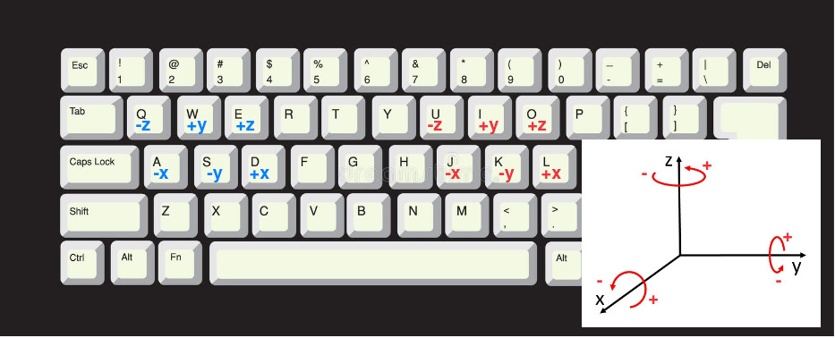
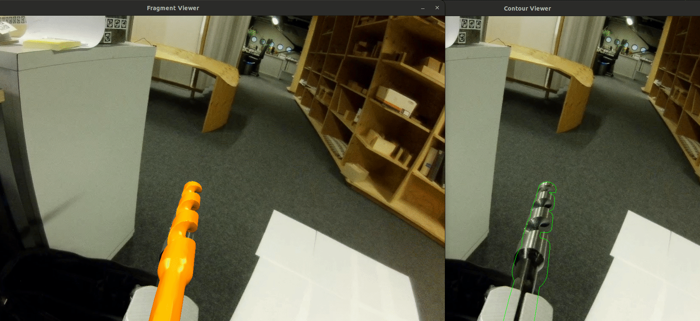

# 2023.03.07 - TSegment integration
With the camera loop from TTool, `segmentation` from `TSegmentation` can be inserted using `consume_image(camera_ptr->image())`

Getting mask can be done using `get_mask()`.

Result


## Next Step
- [x] TSegment according to [contribution style](https://github.com/ibois-epfl/augmented-carpentry/blob/main/CONTRIBUTING.md)Design
- [x] TSegment only exposed functions should be in public otherwise, private
- [x] TSegment [Docstring](https://github.com/ibois-epfl/TSlam/blob/main/src/reconstruction/ts_geometric_solver.hh)
- [X] TSegment passing ref (&) instead of a copy of image
- [x] TSegment fix on real camera
- [x] TSegment separate `compute mask` (public), `get mask` (public) function and getter for `cv::Mat mask` (private)
- [X] Design the TTool dataflow

# 2023.03.13
## Next Step
- [x] TTool::Visualizer (just for debugging no need to put too much time on it)
- [x] TTool:PoseInput (UI for user inputting initial pose) [Design]
    - [ ] TTool:PoseInput Get familiar with CGAL [transformation](https://doc.cgal.org/latest/Kernel_23/classOptimal_bounding_box/index.html) and [OBB](https://doc.cgal.org/latest/Optimal_bounding_box/index.html)
    - [ ] TTool:PoseInput LocalSystem class wrapping OBB and applying transformation to both OBB and actual 6D pose of the 3D Object
    - [ ] TTool:PoseInput KeyMap class for handling user input from keyboard to the rotation and translation
- [x] TTool:PoseInput [Implement]
    - [ ] TTool:PoseInput LocalSystem class
    - [ ] TTool:PoseInput KeyMap class

# 2023.03.20 - TTool::Visualizer
`ttool::Visualizer` is implemented. In TSLET, all the viewers are inside the `Tracker`. However, we decided not to do so as the tracker should only do the tracking. Thus, `ttool::Visualizer` does so instead. `UpdateVisualizer` is used to update all the viewers inside.


# 2023.03.27 - 2023.03.28 - TTool::Input
`TTool::Input` is implemented. In order to do pose adjustment, the user can control it with keybinding



# 2023.04.17 - Tracker
`TSLET` is included in the TTool. For now it it relatively the same as original repo TSLET where we call `Tracker` and use it. The change is `PreProcess`, `EstimatePoses`, `PostProcess` must receive frame image. This was we can pass the segmentation result to the `Tracker` to track the segmentation mask instead. `Tracker::Init()` is not used anymore, as we are no longer passing a camera pointer to the tracker.

Here, the initial pose is intentionally set to be a bit off. After the TSegment has the mask, the tracking starts (frame id increases again), and the pose is then fine tuned.


Information about dependencies related to `Tracker`
```
tracker.hh
    #include "object3d.hh"
    #include "object3d.cc"

    #include "template_view.hh"
    #include "template_view.cc"

        #include "tclc_histograms.hh"
        #include "tclc_histograms.cc"

        #include "signed_distance_transform2d.hh"
        #include "signed_distance_transform2d.cc"


tracker.cc
    #include "histogram.hh"     // This is the crucial part of the tracker
    #include "histogram.cc"     // This is the crucial part of the tracker

    #include "search_line.hh"   // This is the crucial part of the tracker
    #include "search_line.cc"   // This is the crucial part of the tracker

    #include "tracker_sle.hh"
    #include "tracker_sle.cc"

        #include "m_func.hh"
        #include "m_func.cc"
```